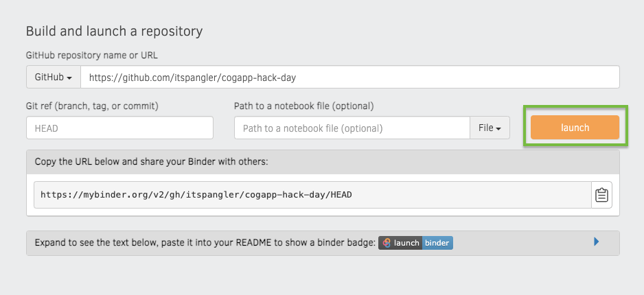

# Accessing LMEC collections via API: two methods

### The Map Center's collections

The Leventhal Map & Education Center is home to a quarter-million cartographic objects, over 11,000 of which are available online in our digital collections portal. You can access those collections at <https://collections.leventhalmap.org>. As a Digital Commonwealth partner institution, you can also find any of our items online at <https://digitalcommonwealth.org>.

### Why API?

[Application programming interfaces (APIs)](https://developer.mozilla.org/en-US/docs/Learn/JavaScript/Client-side_web_APIs/Introduction) allow two different pieces of software to communicate with one another. In the context of LMEC collections, APIs allow you to programmatically retrieve metadata about collections items. This is useful, for example, if you want to build a web app that explores our collections, like Hannah Baker did in a [wonderful blog post for Cogapp](https://blog.cogapp.com/usa-states-challenge-b7d9b4fc027b).

All items in our digital collections can be queried by two related APIs: the **[JSON](https://developer.mozilla.org/en-US/docs/Web/JavaScript/Reference/Global_Objects/JSON) API** and the **[IIIF](https://iiif.io/) API**. As Digital Commonwealth partners, all of our collections adhere to [Digital Commonwealth's API specifications](https://digitalcommonwealth.org).

The following [Jupyter Notebooks](https://jupyter.org/about) provide example code for querying the LMEC's collections via both APIs. Let's get started!

### Using the notebooks

To run these notebooks, simply go to [Binder's landing page](https://mybinder.org), copy-paste this repo's base URL `<https://github.com/bplmaps/collections-api>` into the appropriate input box, and click `Launch`.

You can also clone the repo and run the notebooks locally through something like [Anaconda](https://www.anaconda.com/).

#### [Accessing collections via JSON API](/01_json-api.ipynb)
#### [Accessing collections via IIIF API](/02_iiif-api.ipynb)